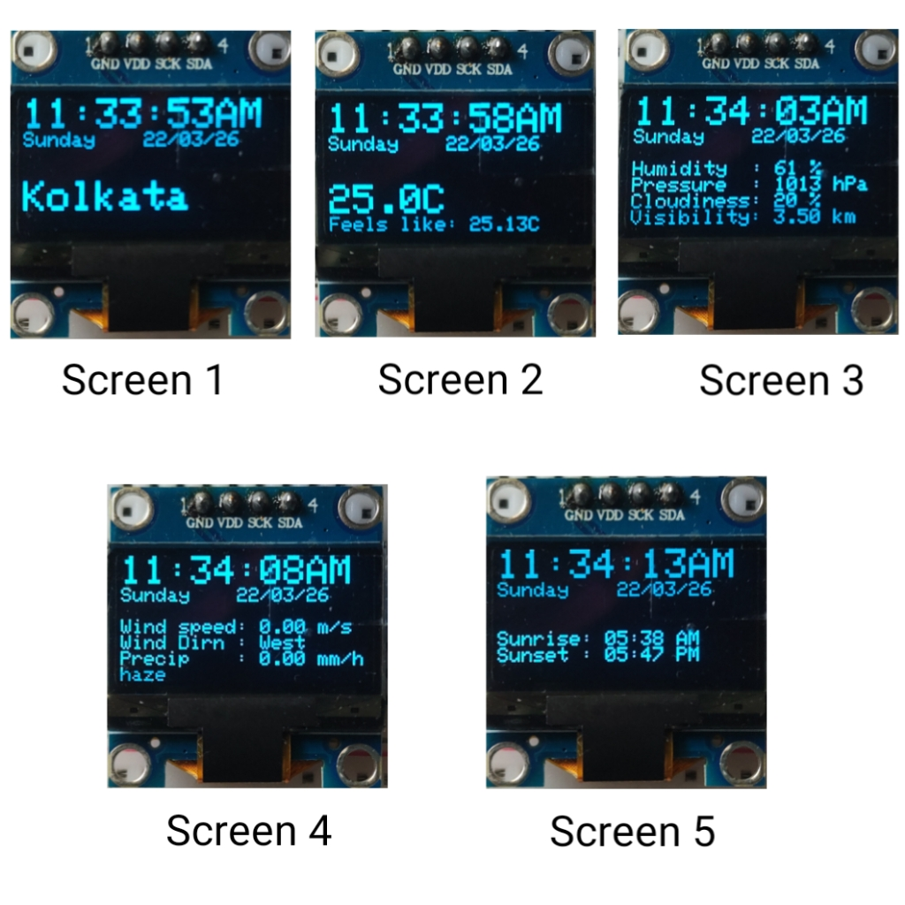
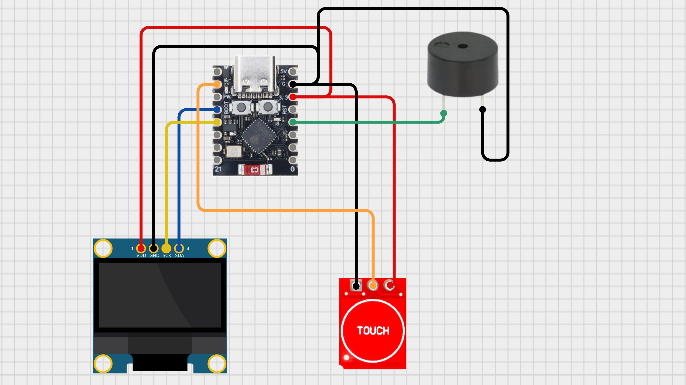
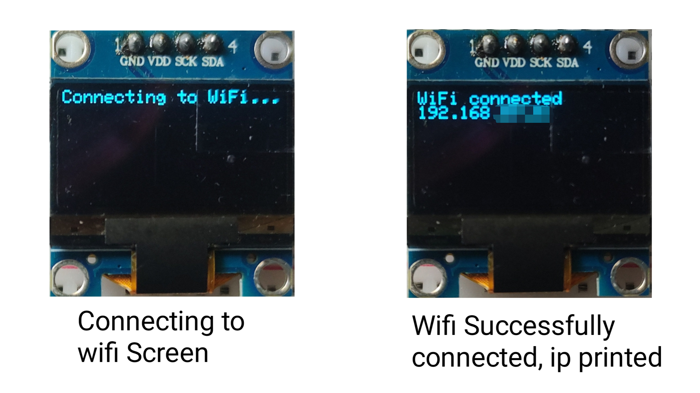
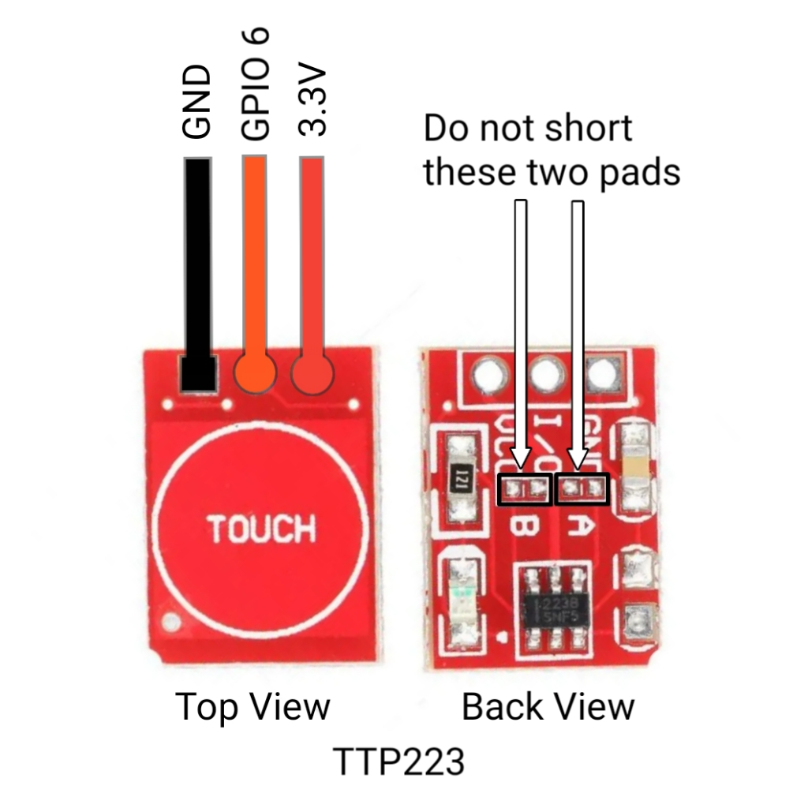

# ESP32C3 Weather Display

A mini weather station using ESP32-C3, an I2C OLED display, and [OpenWeatherMap API](https://openweathermap.org/current?collection=current_forecast). The Esp32 fetches weather data from OpenWeatherMap based on your location(specified in the code) and time(from ntp), and displays information such as temperature, humidity, wind, and sunrise/sunset times etc. on the OLED, cycling through multiple screens automatically or with touch input.



## API response example

```json
{
  "coord": {
    "lon": 88.39,
    "lat": 22.54
  },
  "weather": [
    {
      "id": 721,
      "main": "Haze",
      "description": "haze",
      "icon": "50d"
    }
  ],
  "base": "stations",
  "main": {
    "temp": 26.98,
    "feels_like": 27.65,
    "temp_min": 26.98,
    "temp_max": 26.98,
    "pressure": 1010,
    "humidity": 54,
    "sea_level": 1010,
    "grnd_level": 1010
  },
  "visibility": 4000,
  "wind": {
    "speed": 3.6,
    "deg": 290
  },
  "clouds": {
    "all": 40
  },
  "dt": 1774166584,
  "sys": {
    "type": 1,
    "id": 9114,
    "country": "IN",
    "sunrise": 1774138139,
    "sunset": 1774181870
  },
  "timezone": 19800,
  "id": 1275004,
  "name": "Kolkata",
  "cod": 200
}
```

## Components List

- ESP32-C3 super mini (any esp32 should work)
- SSD1306 128x64 OLED display (I2C)
- TTP223 Touch sensor (or a push button GPIO 6)
- Breadboard & jumper cables(optional)
- A 5v passive buzzer (for future)

## Circuit Diagram



Diagram created using [Cirkit Designer](https://app.cirkitdesigner.com/)

## Assembly Instructions

1. Connect the OLED display to the ESP32-C3 super mini via I2C (SDA to GPIO 8, SCL to GPIO 9, or as per your board's pinout, remember to uncomment `Wire.begin(8, 9);` and specify the pins if you use so).
2. Connect the touch sensor to GPIO 6 (or change the pin in the code).
3. Connect the passive buzzer to GPIO 3 (or change the pin in the code). NOTE: the buzzer is not implemented as of now.
4. Obtain an OpenWeatherMap API key by signing up at https://home.openweathermap.org/api_keys and create a new API key.
5. Find your latitude and longitude using a service like https://www.latlong.net/ or by searching "latitude and longitude of [your location]" on Google.
6. Connect the ESP32-C3 via USB to your computer.
7. Upload the `esp32c3weatherv1.ino` code after entering your `ssid`, `password`, `lat`, `lon`, `apiKey`, `gmtOffset_sec` in the code.
8. Open the Serial Monitor to see debug messages and ensure the ESP32 is connecting to WiFi and fetching weather data successfully.

## Usage

- When the esp32 is turned on, it tries to connect to wifi, once connected it prints the local ip address on the display for a moment.
  

- Then the display will cycle through location(location is auto determined by the latitude and longitude you specify, you may also [refer here](https://openweathermap.org/api/geocoding-api?collection=other) for more information), temperature, humidity, pressure, cloudiness, visibility, wind speed, wind direction, precipitation, and sunrise/sunset time in a loop.
- I've kept the time, day of the week and the date to be visible in every screen.
- Tap the touch sensor to manually cycle screens.

## Pro Tips

- Use a dedicated 3.3V power supply for the OLED if you experience flickering.
- Remove the red power led (blue onboard led too), if you want to use a battery to power it. You might need to use a [LDO](https://en.wikipedia.org/wiki/Low-dropout_regulator).
- You may use seeed studio's XIAO ESP32C3, these XIAO boards have [battery charging capabilities built-in](https://wiki.seeedstudio.com/XIAO_ESP32C3_Getting_Started/#battery-usage), remember to change the pin numbers in the code accordingly.
- Adjust `weatherInterval` and `screenInterval` in the code for faster/slower updates.

## Possible Improvements

- Add weather icons (sun, cloud, rain) using bitmaps. Refer [here](https://openweathermap.org/weather-conditions) for openweathermap's weather condition codes
- Support for multiple locations.
- Get and store the details from a portal(AP mode) instead of hardcoding.
- Add forecast data (not just current weather).
- Battery power and low-power optimizations.
- Utilize the buzzer for weather alerts (e.g., storm warnings).
- Utilize the touch sensor for more interactions (e.g., switch between current weather and forecast, double tap functionality, etc.).
- Utilize the bluetooth capabilities of esp32c3.
- Integrate with home automation systems.

<!-- ```bash
hiiiiii

``` -->

## Note

- Replace all placeholders in the code (`ssid`, `password`, `lat`, `lon`, `apiKey`, `gmtOffset_sec`) with your actual values.
- The ESP32c3 super mini has antenna design flaw, it might not connect to wifi.
- The onboard led(Connected to the GPIO 8 (active low)) of ESP32c3 super mini may blink if you use the default I2C pins.
- Ensure your OpenWeatherMap account is active and the API key is valid.
- The project requires the following Arduino libraries: `WiFi.h`, `HTTPClient.h`, `ArduinoJson.h`, `Adafruit_GFX.h`, `Adafruit_SSD1306.h`, `Wire.h`.

  

<!-- ## Images


--- -->
